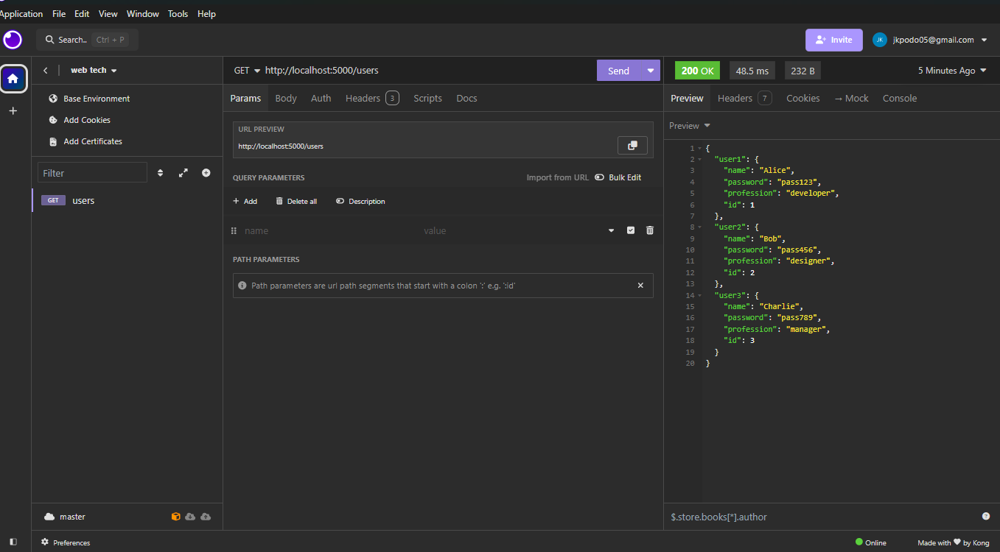
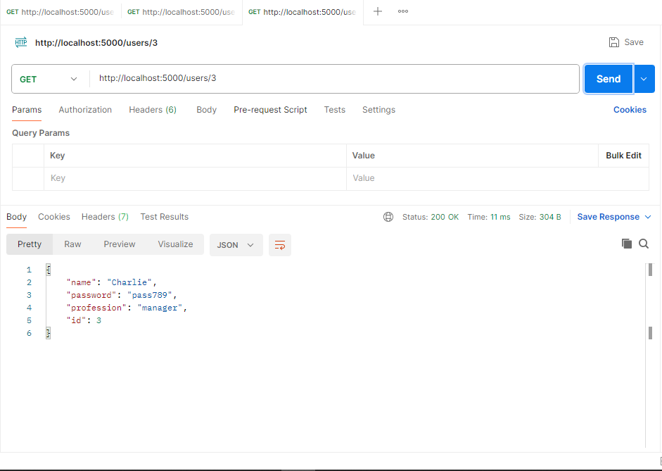
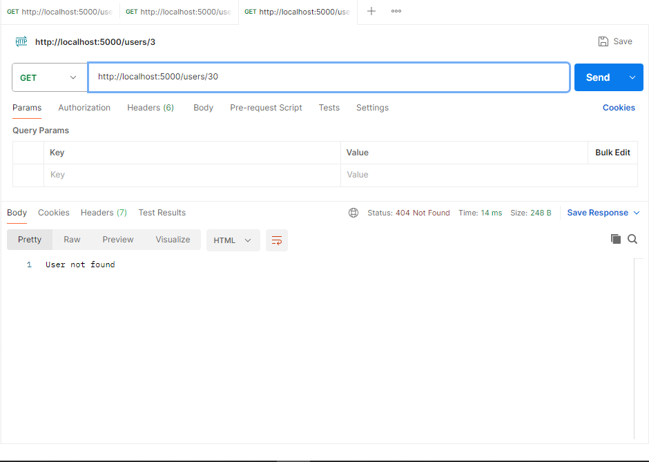
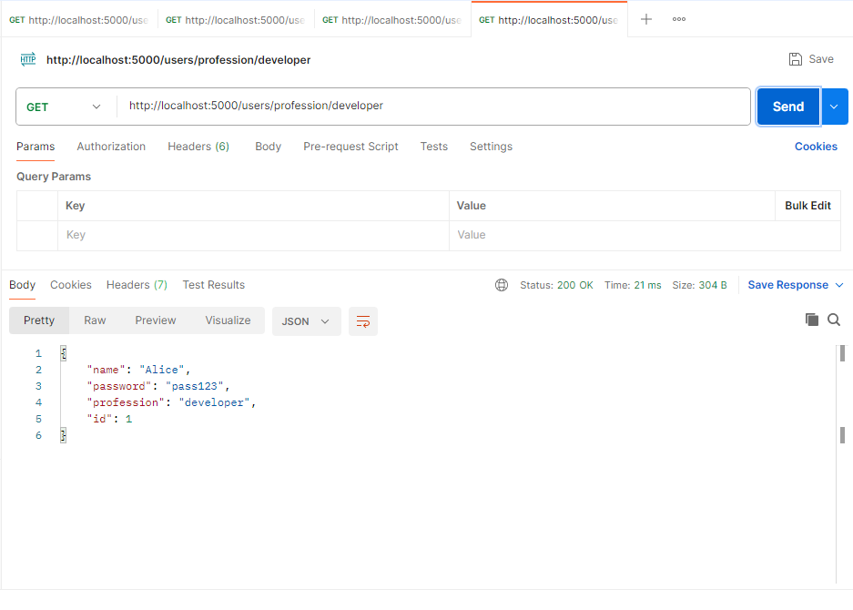
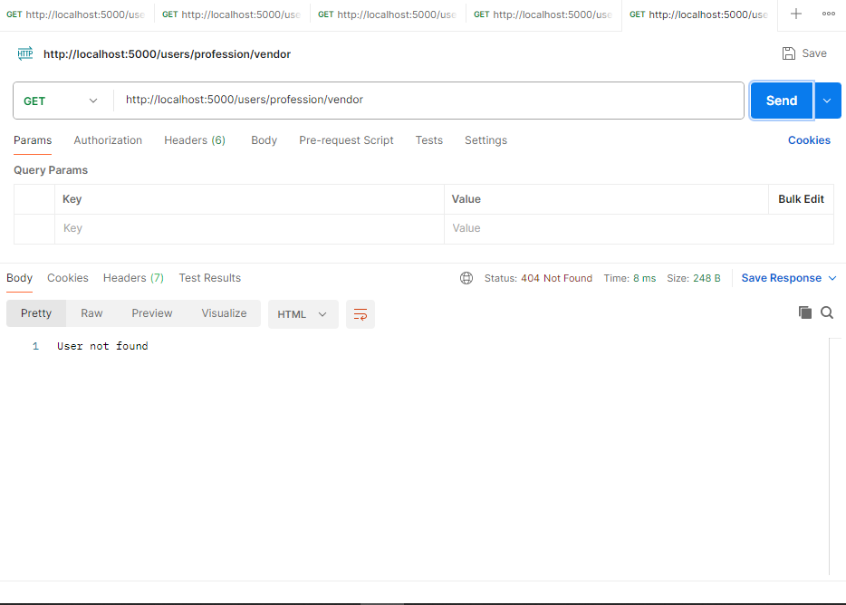
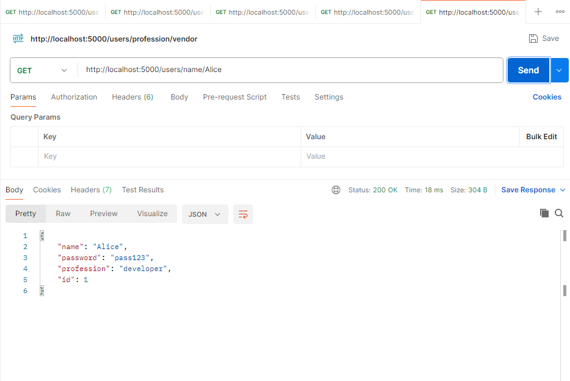
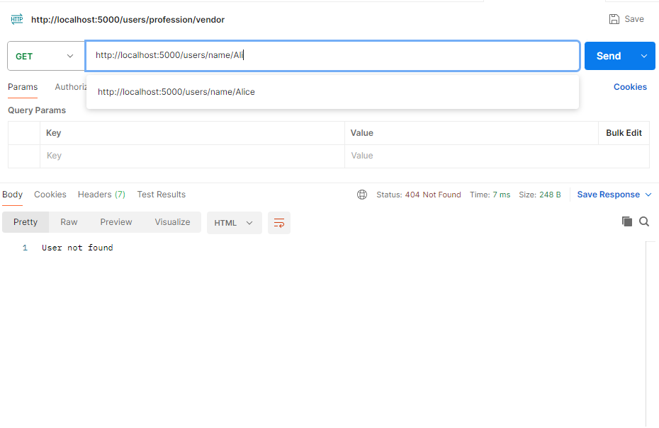

<!-- Please update value in the {}  -->

<h1 align="center">My First Node Js Backend Server</h1>

<!-- OVERVIEW -->

## Overview
-This project was developed as part of my Web Technologies course assignment, focusing on creating a server with endpoints using Node.js and Express.
## Screenshots
- All Users Response

- Users/:id Response

- Users/:id error Response

- Users/profession/:profession Response

- Users/profession/:profession error Response

- Users/name/:name Response

- Users/name/:name error Response

### Built With

<!-- This section should list any major frameworks that you built your project using. Here are a few examples.-->

- [Node JS](https://www.w3schools.com/nodejs/)
- [Express JS](https://www.w3schools.in/express-js/introduction)
- [Javascript](https://www.w3schools.com/js/DEFAULT.asp)

## Features

<!-- List the features of your application or follow the template.) -->
- Returns all users on entering /users endpoint
- Returns a user by id on entering /users/:id endpoint
- Returns a user by profession on entering /users/profession/:profession endpoint
- Returns a user by name on entering /users/name/:name endpoint

## Discussions/Takeaways
- I learnt that Endpoints are the location of the requested resource on an API server. 

## Contact
- GitHub [@onlyjuliuss](https://github.com/onlyjuliuss)
